<html lang="en">
<head>
  <meta charset="UTF-8">
  <meta name="viewport" content="width=device-width, initial-scale=1.0">
  <title>English Tutoring with Paula sensei</title>
  
</head>
<body>
  <header>
    <h1>English Tutoring with Paula sensei</h1>
    
Learn English effectively with a PhD and experienced teacher

  </header>

  <nav>
    <a href="#about">About Me</a>
    <a href="#lessons">Lessons & Pricing</a>
    <a href="#classes">Classes</a>
    <a href="#photos">Photos</a>
    <a href="#contact">Contact</a>
  </nav>
<section id="about">
  <h2>About Me</h2>
  

    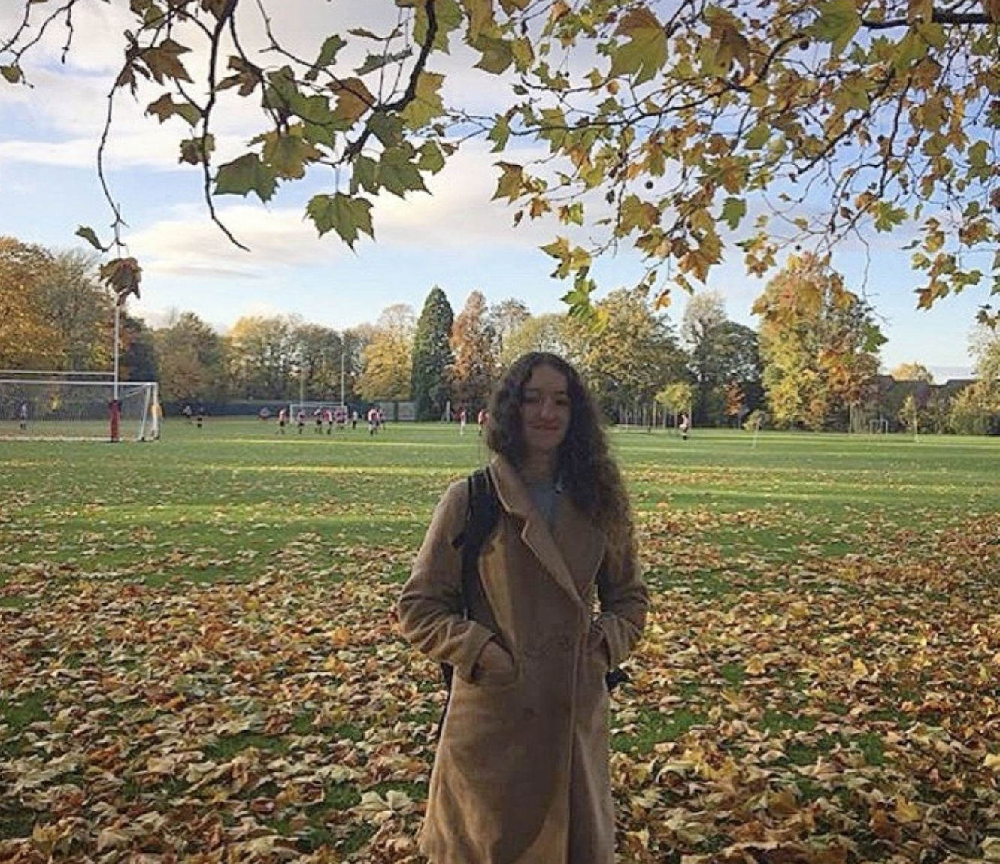
    

      
Hello! I’m Paula, a Master’s degree holder from Oxford University and PhD from Tokyo University, 
        with years of experience teaching English to students of all levels in Japan. I specialize in English teaching, exam preparation (TOEFL, IELTS), and conversation skills. My lessons are personalized, interactive, and designed to help you achieve your English goals!

      
初めまして！私はパウラです。オックスフォード大学で修士号を取得し、東京大学で博士号を取得しました。
      これまで幅広いレベルの生徒に英語を教えてきた経験があります。英語指導、試験対策（TOEFL、IELTS）、会話スキルの習得を専門としており、レッスンは生徒一人ひとりに合わせてカスタマイズされ、インタラクティブで効率的に目標達成をサポートします。

    

  

</section>

  <section id="lessons">
    <h2>Lessons & Pricing</h2>
    <table>
      <tr>
        <th>Lesson Length</th>
        <th>Single Lesson (¥)</th>
      </tr>
      <tr>
        <td>30 minutes</td>
        <td>2,500</td>
      </tr>
      <tr>
        <td>50 minutes</td>
        <td>3,750</td>
      </tr>
      <tr>
        <td>60 minutes</td>
        <td>4,800</td>
      </tr>
      <tr>
        <td>90 minutes</td>
        <td>6,800</td>
      </tr>
    </table>
  </section>

  <section id="classes">
    <h2>Classes / クラス内容</h2>
    <ul>
      <li>English Conversation / 英語会話: 実際の会話を通して流暢さと自信を高めます。</li>
      <li>English Writing / ライティング: エッセイ、メール、レポートなどのライティングスキルを向上させます。</li>
      <li>Grammar & Vocabulary / 文法・語彙: 文法を強化し、語彙を増やします。</li>
      <li>Pronunciation / 発音: 発音、イントネーション、アクセントを改善します。</li>
      <li>Medical English / 医療英語: 医療従事者向けの専門レッスンです。</li>
      <li>Personalized Lesson / パーソナライズドレッスン: 生徒の希望に合わせた特別レッスン。料金は内容により変動します。</li>
    </ul>
  </section>

  <section id="photos">
    <h2>Photos / 写真</h2>
    

      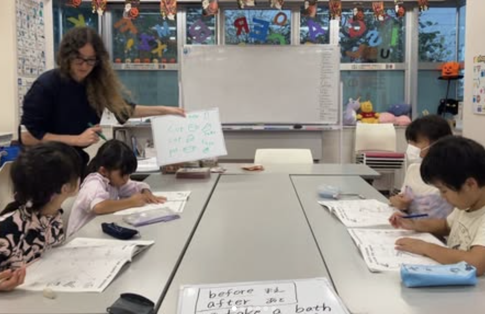
      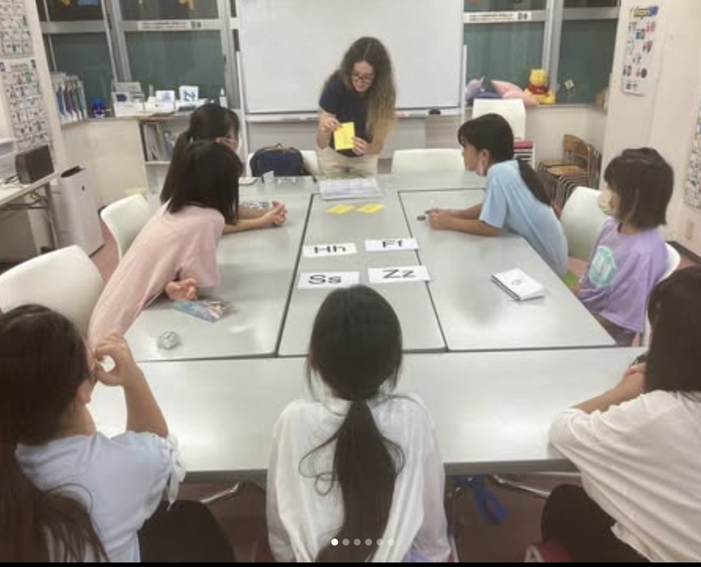
      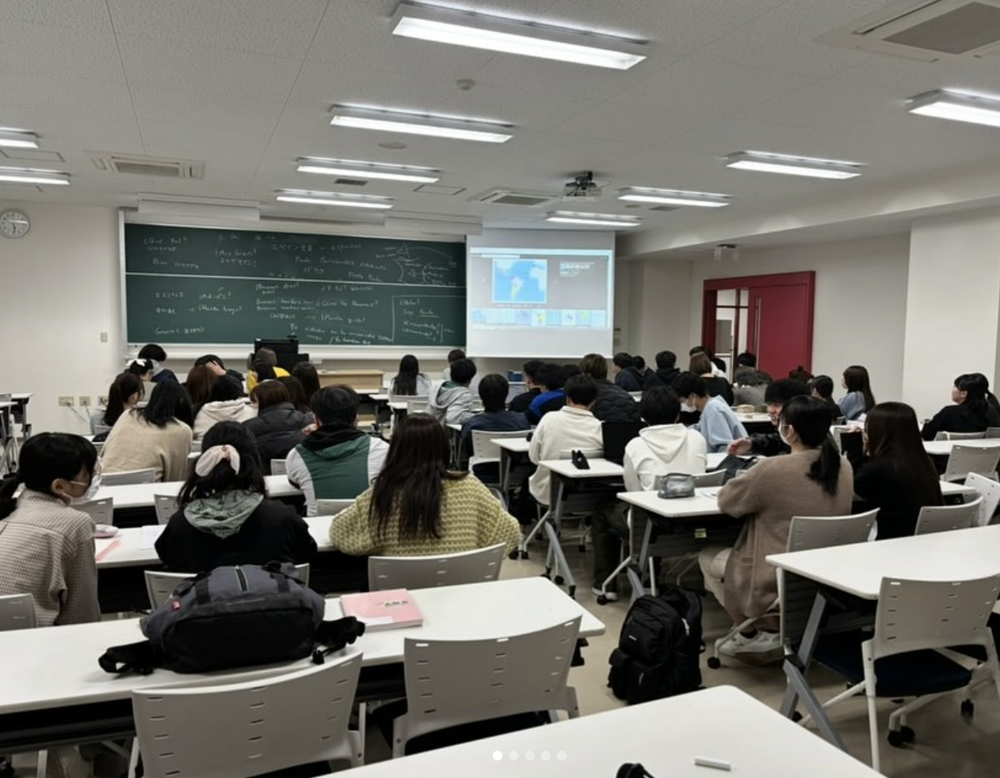
      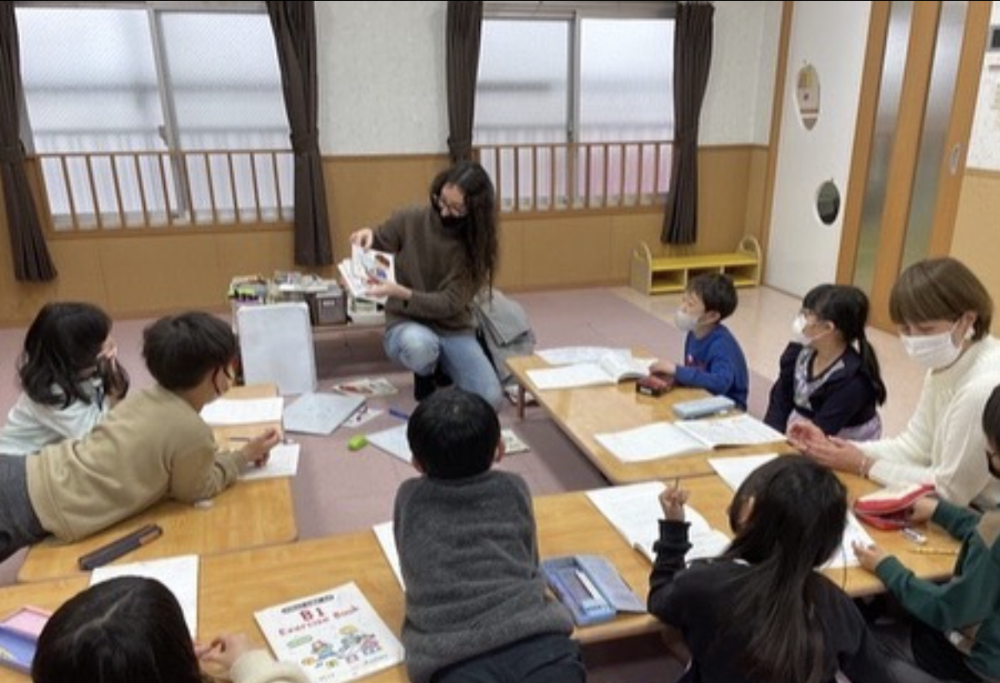
      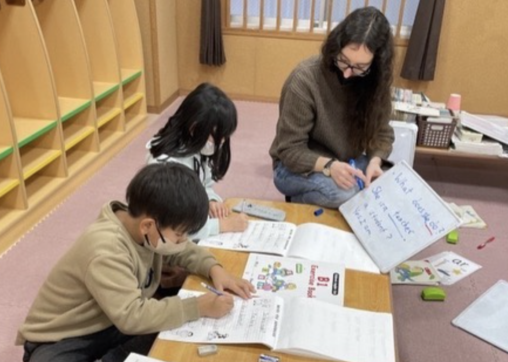
      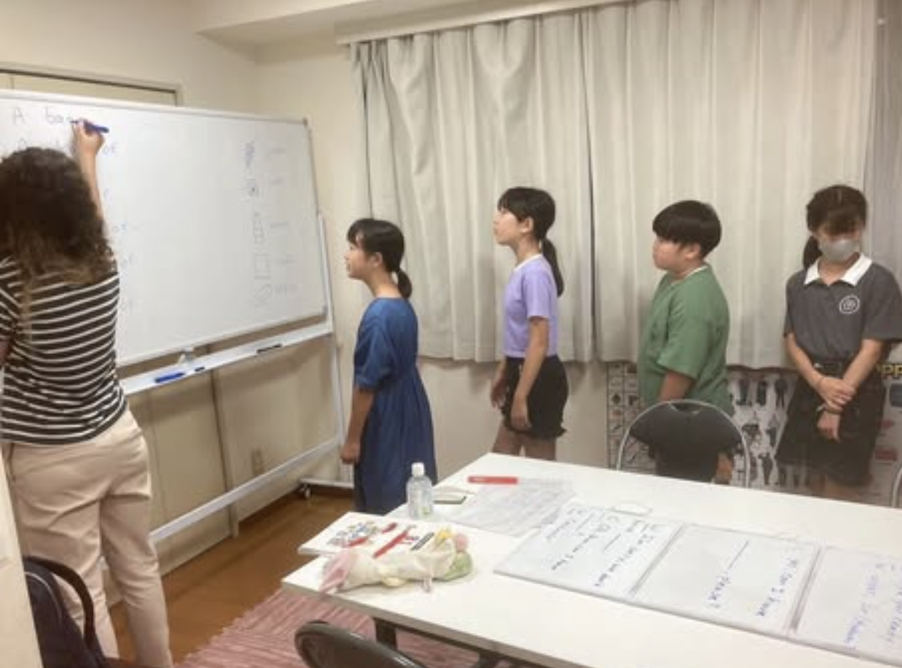
      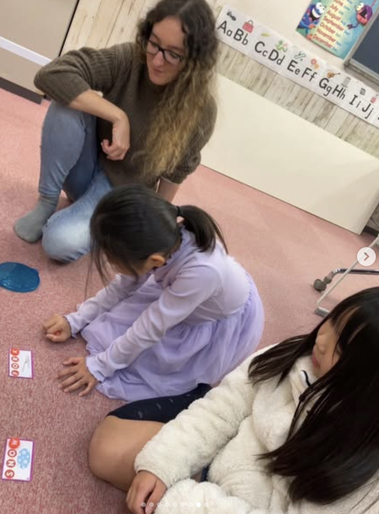
      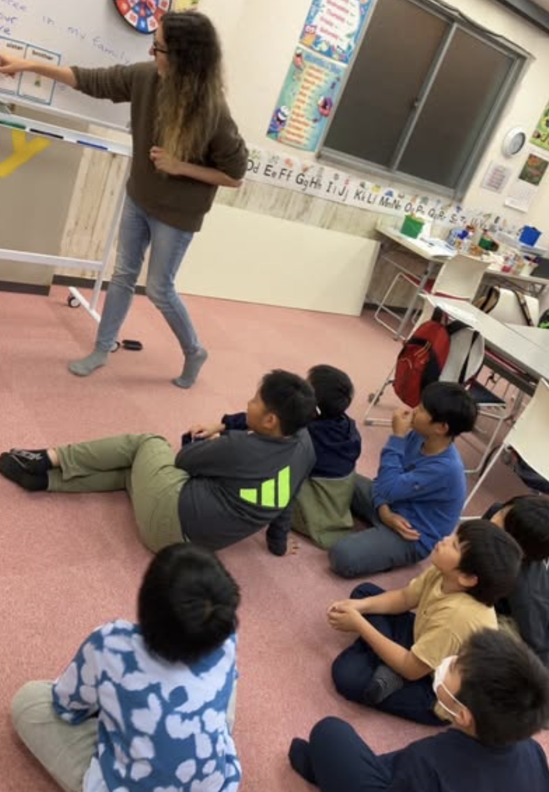
      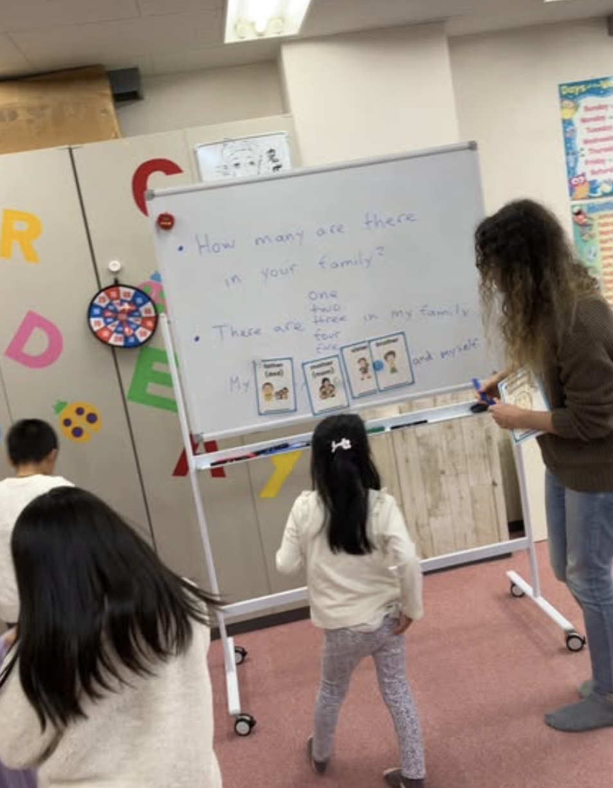
      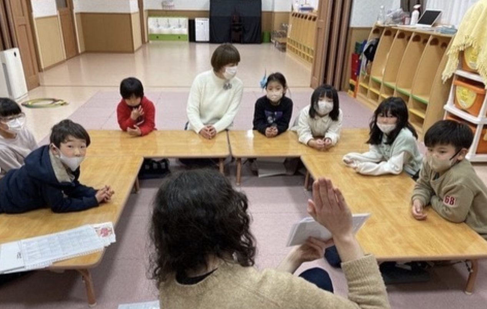
      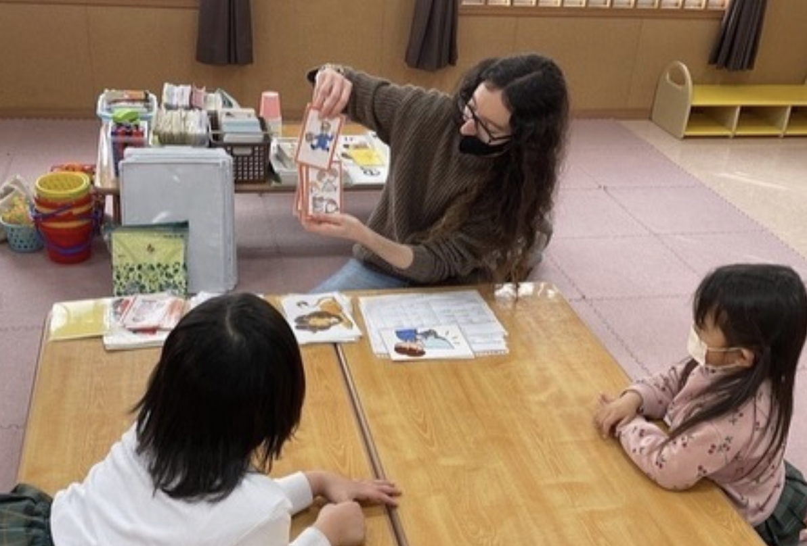
    

  </section>

  <section id="contact">
    <h2>Contact & Booking</h2>
    
Email me at paxfordjp@hotmail.com or fill in the box below to book a lesson. Times depend on availability, and I will confirm your booking as soon as possible.

    
paxfordjp@hotmail.com にご連絡いただくか、下のフォームにご記入の上、レッスンを予約してください。日時は空き状況により異なりますので、確認次第、折り返しご連絡いたします。

    <form action="mailto:paxfordjp@hotmail.com" method="post" enctype="text/plain">
      <label for="name">Name:</label>
      <input type="text" id="name" name="name" required>

      <label for="email">Email:</label>
      <input type="email" id="email" name="email" required>

      <label for="message">Message:</label>
      <textarea id="message" name="message" rows="5" required></textarea>

      <button type="submit">Send Message</button>
    </form>
  </section>

  <footer>
    
&copy; 2026 Paula sensei | English Tutoring

  </footer>
</body>
</html>
